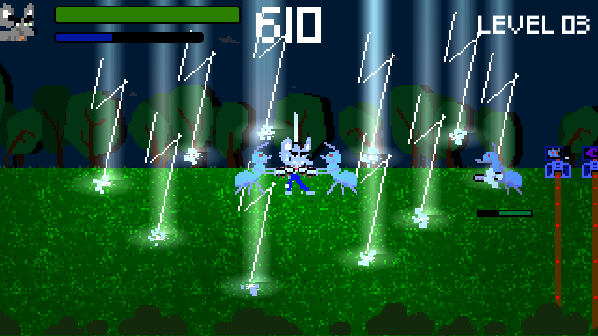
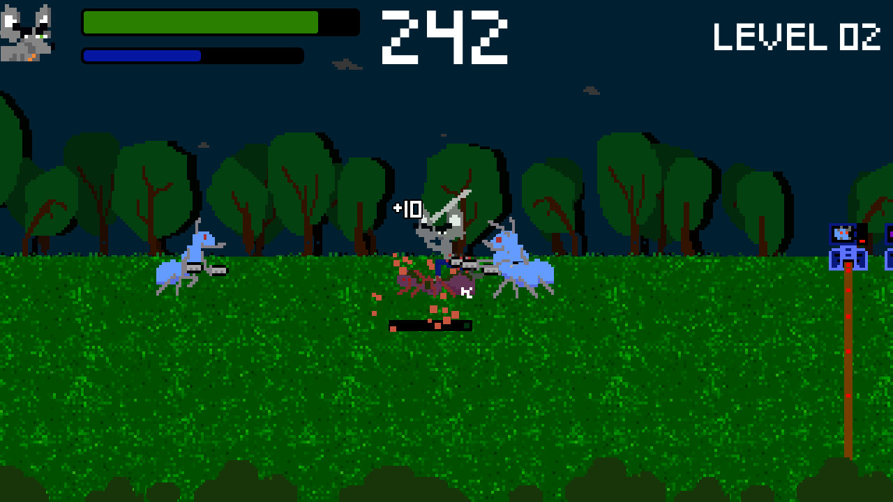
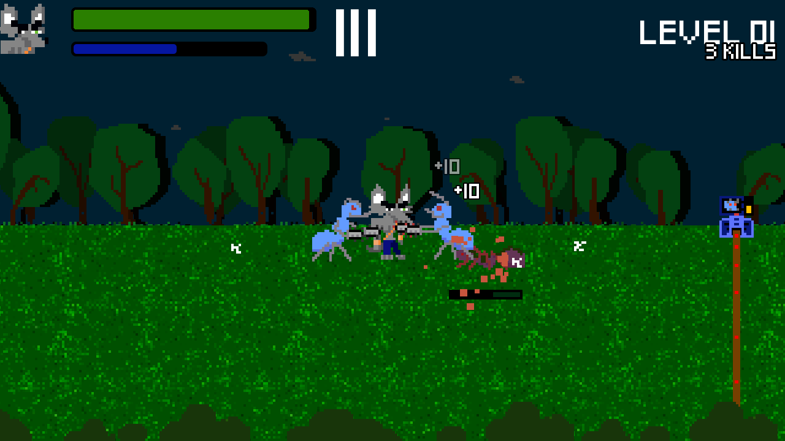
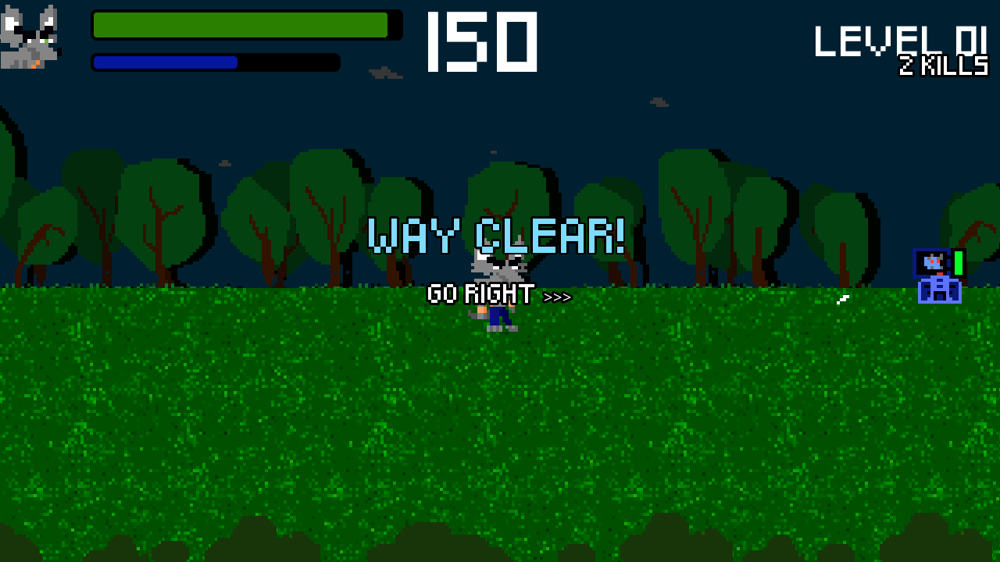
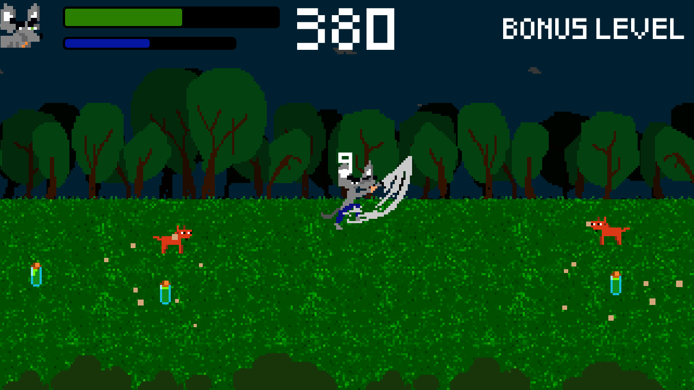
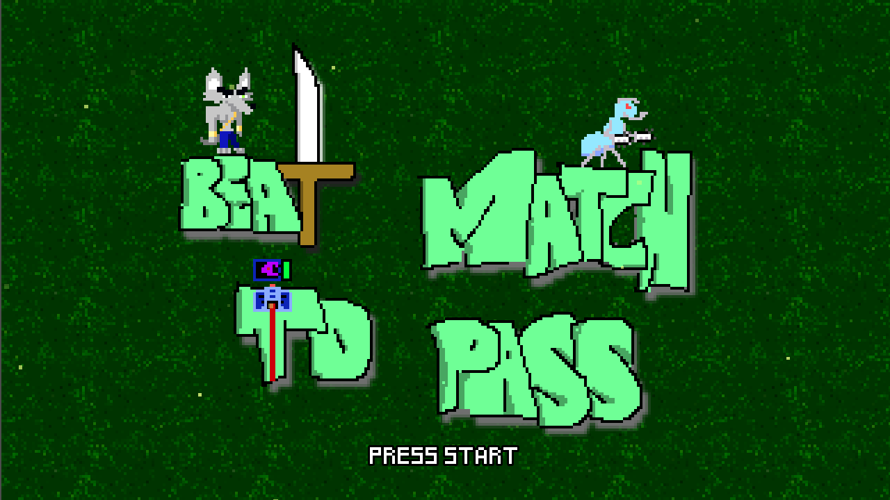

<div align="center">


# ⚔️ Beat And Match To Pass

**Beat them all… or not. Beat only the right number to match and pass!**

Free · Linux x86_64 · Android · Made with Godot 3.6

[](https://flathub.org/apps/org.dupot.beatmatchtopass)
[](https://snapcraft.io/dupot-beat-match-to-pass)
[](https://godotengine.org)
[](LICENSE)

<a href="https://flathub.org/apps/org.dupot.beatmatchtopass"></a>
<a href="https://snapcraft.io/dupot-beat-match-to-pass"></a>

</div>

---

## 📖 About

Gordon stands in front of locked gates. To open each one, he has to **beat exactly the number of enemies it asks for**, then move on to the next.

- 🗡️ **Sword**: slash your way through the enemies standing between you and the gate
- ⚡ **Mana attack**: call down lightning when the crowd gets too big
- 🧪 **Life bottles**: pick them up to get back on your feet
- 👹 **Bosses**: tougher foes wait for you along the way
- 🎁 **Bonus level**: an extra challenge for those who make it
- 🏆 **Best scores**: try to beat your own record

Count your hits, open the gates, and reach the end of every level.

## 📸 Screenshots

<div align="center">

| | | |
|:---:|:---:|:---:|
|  |  |  |
|  |  |  |

</div>

## 🎮 Controls

| Action | Keyboard | Gamepad |
|---|---|---|
| Move | ← ↑ → ↓ arrow keys | D-pad / stick |
| Sword attack | `Enter` or `Space` | Button A |
| Mana attack (lightning) | `Ctrl` | Button B |

⌨️ Keys can be remapped from the **Settings** menu, and Android gets on-screen touch controls.

## 📦 Install

### Flathub (Linux, recommended)

```bash
flatpak install flathub org.dupot.beatmatchtopass
flatpak run org.dupot.beatmatchtopass
```

You can also install it from GNOME Software, KDE Discover or any app store that uses Flathub. The Flatpak manifest lives in [flathub/org.dupot.beatmatchtopass](https://github.com/flathub/org.dupot.beatmatchtopass).

### Snap Store (Linux)

```bash
sudo snap install dupot-beat-match-to-pass
```

## 🛠️ Build from source

1. Install [Godot 3.6](https://godotengine.org/download/3.x).
2. Clone the repository:
   ```bash
   git clone https://github.com/imikado/dupotBeatAndMatchToPass.git
   ```
3. Open `project.godot` in Godot and press **F5** to play.

Export presets for **Linux**, **Android**, **Android TV / Fire TV** and **HTML5** are included in `export_presets.cfg`. Snap packaging files live in [`export/linux/snap`](export/linux/snap).

## 🕹️ More from dupot.org

Also on Flathub from the same developer:

- **Save the Sheep**
- **Little Adventure**
- **Easyflatpak**

See them all on [dupot.org](https://www.dupot.org/games.html).

## 🐛 Feedback

Found a bug or have an idea? [Open an issue](https://github.com/imikado/dupotBeatAndMatchToPass/issues).

## 📜 License

This game is released under the [GNU LGPL v2.1](LICENSE).

---

<div align="center">

Made with ❤️ and [Godot Engine](https://godotengine.org) by [Michael Bertocchi](https://www.dupot.org/games.html) · [dupot.org](https://www.dupot.org)

</div>
