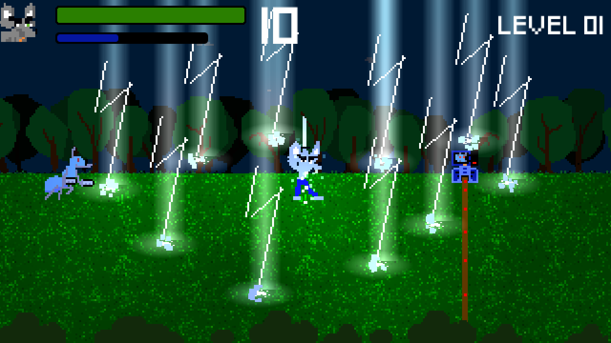
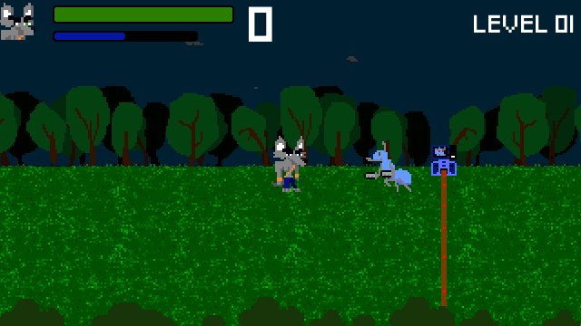

<div align="center">


# ⚔️ Beat And Match To Pass

**Beat them all… or not. Beat the *right* enemies to open the way!**

A fast pixel-art beat 'em up where every swing counts.
Free · Linux · Android · Made with Godot 4

[](https://flathub.org/apps/org.dupot.beatmatchtopass)
[](https://snapcraft.io/dupot-beat-match-to-pass)
[](https://godotengine.org)
[](LICENSE)

<a href="https://flathub.org/apps/org.dupot.beatmatchtopass"></a>
<a href="https://snapcraft.io/dupot-beat-match-to-pass"></a>



</div>

---

## 📖 The idea

Gordon's path through the forest is blocked by **electric barriers**. Each barrier shows an enemy: an ant, a beetle or a spider. Only defeating **that kind of enemy** charges it, and once it is full, it shuts down and the way is open.

So you don't just mash buttons: you pick your targets, keep your combo going and save your lightning for the right moment. Clear every barrier, reach the gate, and move on to the next level.

<div align="center">



</div>

## ✨ Features

- 🗡️ **Four-hit sword combo**: keep pressing attack to chain slashes, and land three combo hits on the same enemy for a score bonus.
- 🔥 **Kill streaks**: every 5 kills in a row raise your score multiplier, up to **x4**. Get hit and the streak is gone.
- ⚡ **Lightning storm**: spend your mana to darken the sky and call down three volleys of lightning on everything around you. You can't be hurt while casting, so it also works as a panic button.
- 🐜 **Three enemy types**: ants swarm you, beetles hit hard, and spiders shoot from a distance. Beetles join in at level 2 and spiders at level 3, and every level adds more barriers to open.
- 🧪 **Life bottles**: they show up from level 2 on to heal you mid-fight.
- 🐿️ **Bonus stage**: between levels you get 15 seconds to hit the squirrels and grab extra life bottles.
- 🏆 **Best scores**: chase your record, with a big *NEW RECORD!* when you beat it.
- 🎵 **Chiptune music and retro sound effects**, plus hit-stop, screen shake and particles that make every blow land.
- ⏸️ **Pause anytime**, keys you can remap, gamepad support and on-screen touch controls on Android.

## 🎬 From boot to battle

A loading screen that really preloads the game, an animated title, a lively menu and smooth fades between every screen.

<div align="center">


</div>

## 📸 Screenshots

<div align="center">

| | | |
|:---:|:---:|:---:|
|  |  |  |
|  |  |  |

</div>

## 🎮 Controls

| Action | Keyboard | Gamepad |
|---|---|---|
| Move | ← ↑ → ↓ arrow keys | D-pad / stick |
| Sword attack (press again to chain the combo) | `Enter` or `Space` | Button A |
| Lightning storm (needs mana) | `Ctrl` | Button B |
| Pause | `Esc` | Start |
| Music on / off | `M` | — |

⌨️ Keys can be remapped from the **Settings** menu, and Android gets on-screen touch controls.

## 💡 Tips

- **Look at the barrier icon** before you fight: defeating the wrong species won't charge the barrier.
- **Protect your streak.** Backing off for a second is often worth more than trading hits.
- **Mana refills on its own** and with every kill. The bar turns blue and *MANA READY* pops up when you can cast again.
- **Keep the storm for crowds**, or for when a spider has you in its sights: you're untouchable while casting.

## 📦 Install

### Flathub (Linux, recommended)

```bash
flatpak install flathub org.dupot.beatmatchtopass
flatpak run org.dupot.beatmatchtopass
```

You can also install it from GNOME Software, KDE Discover or any app store that uses Flathub. The Flatpak manifest lives in [flathub/org.dupot.beatmatchtopass](https://github.com/flathub/org.dupot.beatmatchtopass).

### Snap Store (Linux)

```bash
sudo snap install dupot-beat-match-to-pass
```

## 🛠️ Build from source

1. Install [Godot 4.7](https://godotengine.org/download).
2. Clone the repository:
   ```bash
   git clone https://github.com/imikado/dupotBeatAndMatchToPass.git
   ```
3. Open `project.godot` in Godot and press **F5** to play.

Export presets for **Linux** and **Android** are included in `export_presets.cfg`. Snap packaging files live in [`export/linux/snap`](export/linux/snap).

All the sound effects and the music are generated by a small dependency-free Python script. Tweak it and run it again to change them:

```bash
python3 tools/generate_audio.py
```

## 🕹️ More from dupot.org

Also on Flathub from the same developer:

- **Save the Sheep**
- **Little Adventure**
- **Easyflatpak**

See them all on [dupot.org](https://www.dupot.org/games.html).

## 🐛 Feedback

Found a bug or have an idea? [Open an issue](https://github.com/imikado/dupotBeatAndMatchToPass/issues).

## 📜 License

This game is released under the [GNU LGPL v2.1](LICENSE).

---

<div align="center">

Made with ❤️ and [Godot Engine](https://godotengine.org) by [Michael Bertocchi](https://www.dupot.org/games.html) · [dupot.org](https://www.dupot.org)

</div>
